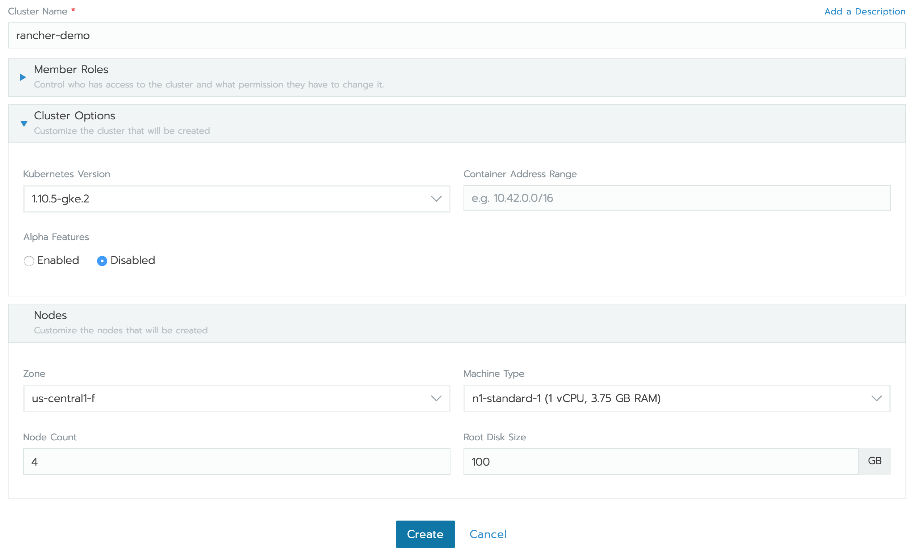
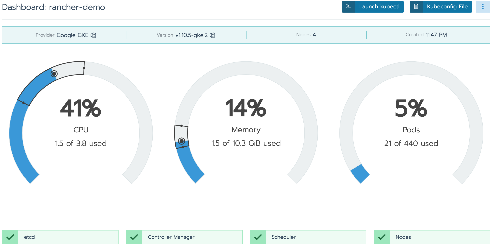
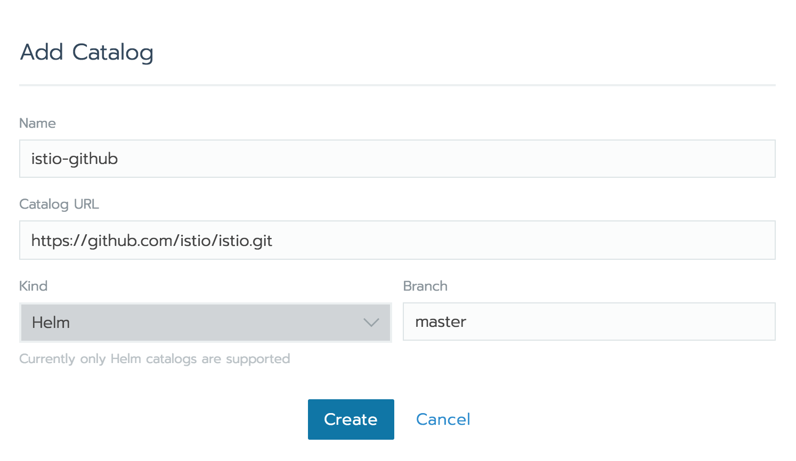
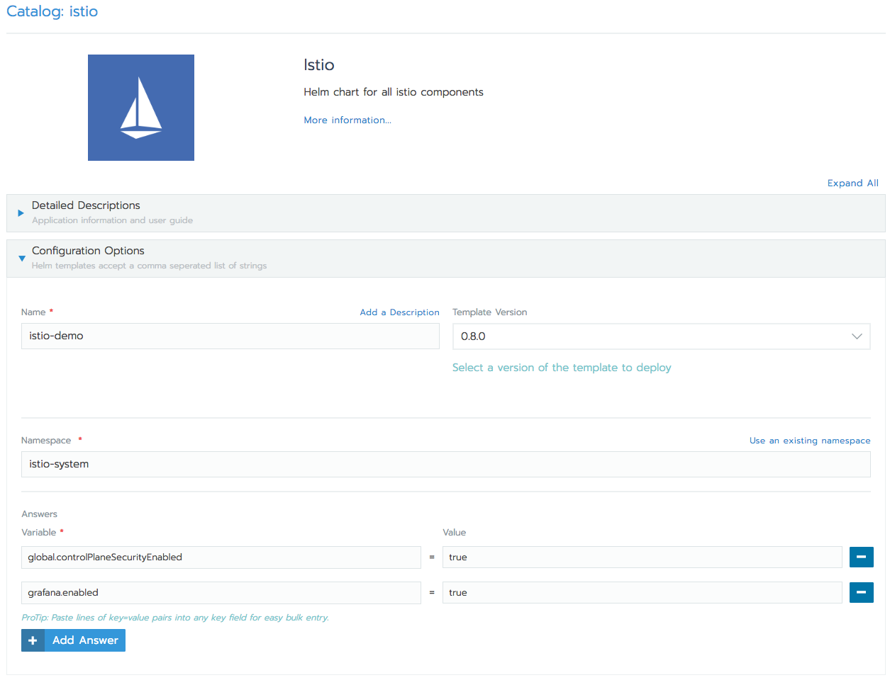
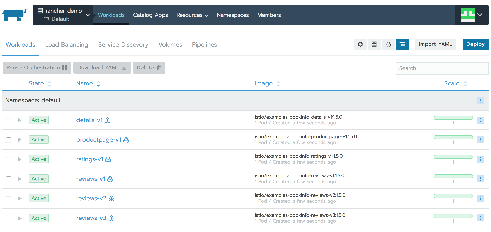
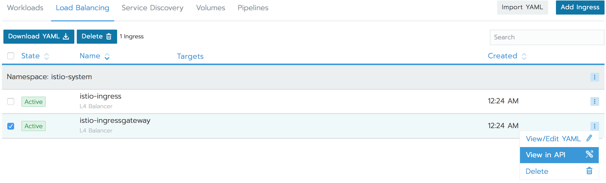
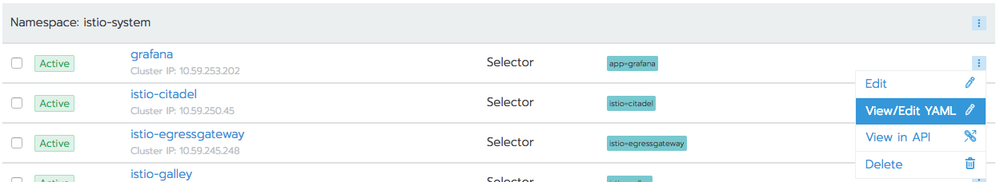
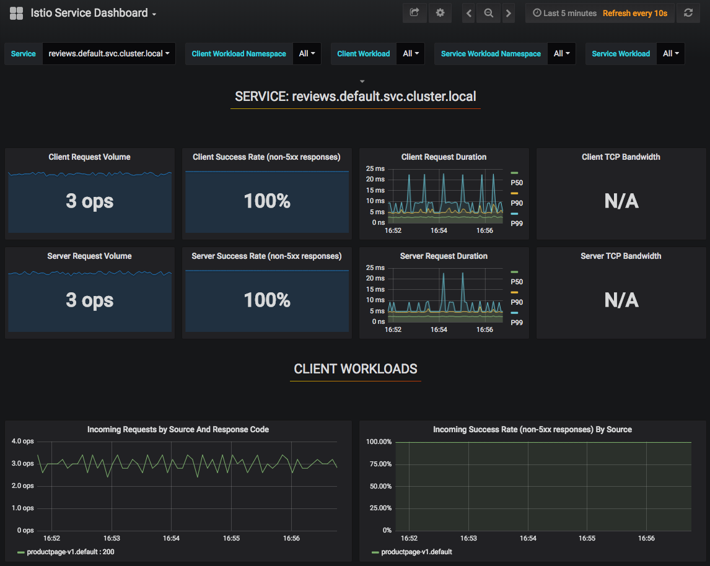
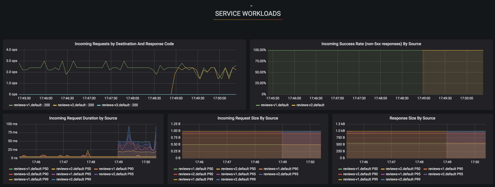

# **Deploying Istio using Rancher 2.0**

Service mesh is a new technology stack aimed at solving the connectivity problem between cloud native applications. If you want to build a cloud native application, you need a service mesh. One of the big players in the service mesh world is Istio. Istio is best described in their own [about page](https://istio.io/about/intro/). It's a very promising service mesh solution, based on [Envoy Proxy](https://www.envoyproxy.io/), having multiple tech giants contributing to it.

### Below is an overview of how you can deploy Istio using [Rancher 2.0](https://rancher.com/docs/rancher/v2.x/en/)

Istio, at the moment works best with Kubernetes, but they are working to bring support for other platforms too. So to deploy Istio and demonstrate some of it's capabilities, there's a need of a kubernetes cluster. To do that is pretty easy using Rancher 2.0.

#### Starting a Rancher 2.0 instance

For the beginning, start a Rancher 2.0 instance. There's a very intuitive getting started guide for this purpose [here](https://rancher.com/quick-start/). Just to be sure you'll get the information, the steps will be outlined below too.

This example will use Google Cloud Platform, so let's start and Ubuntu instance there and allow HTTP and HTTPs traffic to it, either via [Console or CLI](https://cloud.google.com/compute/docs/instances/create-start-instance). Here's an example command to achieve the above:
```
gcloud compute --project=rancher-20 instances create rancher-20 \
--zone=europe-west2-a --machine-type=n1-standard-1 \
--tags=http-server,https-server --image=ubuntu-1604-xenial-v20180627 \
--image-project=ubuntu-os-cloud

gcloud compute --project=rancher-20 firewall-rules create default-allow-http \
--direction=INGRESS --priority=1000 --network=default --action=ALLOW \
--rules=tcp:80 --source-ranges=0.0.0.0/0 --target-tags=http-server

gcloud compute --project=rancher-20 firewall-rules create default-allow-https \
--direction=INGRESS --priority=1000 --network=default --action=ALLOW \
--rules=tcp:443 --source-ranges=0.0.0.0/0 --target-tags=https-server
```

Make sure you have at least **1 vCPU** and about **4GB** of RAM available for the rancher instance.
Next step is to ssh into the instance and [install docker](https://docs.docker.com/install/linux/docker-ce/ubuntu/). Once docker is installed, start Rancher and verify it's running:
```
ubuntu@rancher-20:~$ sudo docker run -d --restart=unless-stopped -p 80:80 -p 443:443 rancher/rancher
Unable to find image 'rancher/rancher:latest' locally
latest: Pulling from rancher/rancher
6b98dfc16071: Pull complete
4001a1209541: Pull complete
6319fc68c576: Pull complete
b24603670dc3: Pull complete
97f170c87c6f: Pull complete
c5880aba2145: Pull complete
de3fa5ee4e0d: Pull complete
c973e0300d3b: Pull complete
d0f63a28838b: Pull complete
b5f0c036e778: Pull complete
Digest: sha256:3f042503cda9c9de63f9851748810012de01de380d0eca5f1f296d9b63ba7cd5
Status: Downloaded newer image for rancher/rancher:latest
2f496a88b82abaf28e653567d8754b3b24a2215420967ed9b817333ef6d6c52f
ubuntu@rancher-20:~$ sudo docker ps
CONTAINER ID        IMAGE               COMMAND                  CREATED              STATUS              PORTS                                      NAMES
2f496a88b82a        rancher/rancher     "rancher --http-list…"   About a minute ago   Up 59 seconds       0.0.0.0:80->80/tcp, 0.0.0.0:443->443/tcp   elegant_volhard
```

Get the public IP address of the instance and point your browser to it:
```
$ gcloud compute instances describe rancher-20 --project=rancher-20 --format="value(networkInterfaces[0].accessConfigs[0].natIP)"
35.189.72.39
```
You should be redirected to a HTTPS page of Rancher and you should see a warning from your browser, because Rancher uses a self signed certificate. Ignore the warnings, because this is the instance that you have started (**never do that on untrusted sites!**), and proceed to set up Rancher 2.0 by setting the admin password and server URL. That was it, you have Rancher 2.0 running. Now it's time to start your kubernetes cluster.

#### Starting a Kubernetes Cluster

For that you'll need a Google Cloud Service Account with the following Roles attached to it `Compute Viewer`, `Kubernetes Engine Admin`, `Service Account User`, `Project Viewer`. Afterwards you need to generate service account keys, as described [here](https://cloud.google.com/iam/docs/creating-managing-service-account-keys)

Now get your service account keys (it's safe to use the default Compute Engine service account), you will need them to start a kubernetes cluster using Rancher 2.0:
```
gcloud iam service-accounts keys create ./key.json \
    --iam-account <SA-NAME>@developer.gserviceaccount.com
```

Note the `<SA-NAME>@developer.gserviceaccount.com` value, you will need it later.

Now you're ready to start your cluster. Go to Rancher dashboard and click on **Add Cluster**. Make sure about the followings:
 * select Google Container Engine for the hosted Kubernetes provider;
 * give your cluster a name, for example `rancher-demo`;
 * import or copy/paste the service key details from `key.json` file (generated above) into `Service Account` field;

Proceed with **Configure Nodes** option and select the followings:
 * for `Kubernetes Version` it should be safe to select the latest available version, this test was done on `1.10.5-gke.2` version;
 * select the zone that is closer to you;
 * for `Machine Type` it needs to be at least n1-standard-1;
 * for Istio Demo, the `Node Count` should be at least 4;

It would look like the image below:



Click with confidence on ***Create***

After several minutes you should see your cluster as active in Rancher dashboard. Remember that `<SA-NAME>@developer.gserviceaccount.com` value? You need it now, to grant cluster admin permissions to the current user (admin permissions are required to create the necessary RBAC rules for Istio). To do that, click on the `rancher-demo` Cluster Name in Rancher Dashboard, that will take you to rancher-demo Cluster dashboard, it should look similar to the image below:



<a name="kubectl"></a>Now `Launch kubectl`, this will open a kubectl command line for this particular cluster. You can also export the `Kubeconfig File` to use with your locally installed kubectl. For this purpose it should be enough to use the command line provided by Rancher. Once you have the command line opened, run the following command there:
```
> kubectl create clusterrolebinding cluster-admin-binding \
    --clusterrole=cluster-admin \
    --user=<SA-NAME>@developer.gserviceaccount.com

clusterrolebinding "cluster-admin-binding" created
>
```

#### Deploying Istio on Rancher

Istio has a [Helm](https://helm.sh/) package and Rancher can consume that Helm package and install Istio. To get the official Istio Helm package, it's best to add Istio's repository to Rancher Apps Catalog. To do that, go to Rancher **Global** View, then to **Catalogs** option and select `Add Catalog`. Fill in there as follows:
* for name, let's put there `istio-github`;
* in Catalog URL, paste the following URL: https://github.com/istio/istio.git (Rancher works with anything `git clone` can handle)
* the Branch part should allow you now to write the branch name, set it to `master`
It should look as in the screenshot below:



Hit **Create**

At this stage, you should be able to deploy Istio using Rancher's Catalog. To do that, go to the Default Project of `rancher-demo`'s cluster and select `Catalog Apps` there. Once you click on **Launch**, you will be presented with a number of default available applications. As this demo is about Istio, select from All Catalogs, the `istio-github` catalog, that you've just created. This will present you with 2 options `istio` and `istio-remote`. Select `View Details` for **istio** one. You'll be presented with the options to deploy Istio. Select the followings:
* let's set the name to `istio-demo`;
* leave the template version to *0.8.0*;
* the default namespace used for istio is `istio-system`, thus set the namespace to `istio-system`;
* by default, Istio doesn't encrypt traffic between it's components. That's a very nice feature to have, let's add it. On the same topic, Istio's helm chart doesn't add by default Grafana, that's very useful to have, let's add this one too. This is done by setting to true the `global.controlPlaneSecurityEnabled` and `grafana.enabled` variables. To do this:
  - click **Add Answer**;
  - put the variable name `global.controlPlaneSecurityEnabled`;
  - set it's Value to `true`;
  - do the same for `grafana.enabled`;

All of the above should look like in the screenshot below:



Everything looks good, click on **Launch**

Now if you look at the `Workloads` tab, you should see there all the components of Istio spinning up in your Cluster. Make sure all of the workloads are green. Also, check the `Load Balancing` tab, you should have `istio-ingress` and `istio-ingressgateway` there, both in `Active` state.

In case you have `istio-ingressgateway` in `Pending` state, you need to apply `istio-ingressgateway` service once again. To do that:
* click on **Import Yaml**;
* for Import Mode, select `Cluster: Direct import of any resources into this cluster`;
* copy/paste [istio-demo-ingressgateway.yaml](https://raw.githubusercontent.com/jaguarrr/istio-rancher-demo/master/istio-demo-ingressgateway.yaml) Service into the Import Yaml editor and hit **Import**:

This step should solve the `Pending` problem with `istio-ingressgateway`.

You should now check that all Istio's `Workloads`, `Load Balancing` and `Service Discovery` parts are green in Rancher Dashboard.

One last thing to add, so Istio sidecar container is injected automatically into your pods, run the following kubectl command (you can launch kubectl from inside Rancher, as described [above](#kubectl)), to add a `istio-injected` label to your default namespace:
```
> kubectl label namespace default istio-injection=enabled
namespace "default" labeled
> kubectl get namespace -L istio-injection
NAME            STATUS    AGE       ISTIO-INJECTION
cattle-system   Active    1h
default         Active    1h        enabled
istio-system    Active    37m
kube-public     Active    1h
kube-system     Active    1h
>
```

This label, will make sure that Istio-Sidecar-Injector will automatically inject Envoy containers into your application pods

#### Deploying Bookinfo sample app

Only now, you can deploy a test application and test the power of Istio. To do that, let's deploy the [Bookinfo sample application](https://istio.io/docs/guides/bookinfo/). The interesting part of this application is that it has 3 versions of the reviews app, running at the same time. Here's where we can see some of Istio's features.
Go to the `rancher-demo` Default project workloads to deploy the Bookinfo app:
* click on **Import Yaml**;
* download the following [bookinfo.yaml](https://raw.githubusercontent.com/jaguarrr/istio-rancher-demo/master/bookinfo/bookinfo.yaml) to your local computer;
* upload it to Rancher by using the **Read from file** option, after you enter the Import Yaml menu;
* for the `Import Mode` select `Cluster: Direct import of any resources into this cluster`;
* click on **Import**

This should add 6 more workloads to your `rancher-demo` Default project. Just like in the screenshot below:



Now to expose the Bookinfo app via Istio, you need to apply this [bookinfo-gateway.yaml](https://raw.githubusercontent.com/jaguarrr/istio-rancher-demo/master/bookinfo/bookinfo-gateway.yaml) the same way as the `bookinfo.yaml`.
At this moment, you can access the bookinfo app with your browser. Get the external IP address of the `istio-ingressgateway` Load Balancer. There are several ways to find this IP address. From Rancher, you can go to Load Balancing, and from the right hand side menu select `View in API`, just like in the screenshot below:



It should open in a new browser tab, search there for `publicEndpoints -> addresses` and you should see the public IP address.
Another way is via kubectl:
```
> export INGRESS_HOST=$(kubectl -n istio-system get service istio-ingressgateway -o jsonpath='{.status.loadBalancer.ingress[0].ip}')
> echo $INGRESS_HOST
```

Point your browser to `http://${INGRESS_HOST}/productpage` and you should see the Bookinfo app. If you refresh your page multiple times, you should see 3 different versions for the `Book Reviews` part:
- first one with no stars;
- second one with black stars;
- third one with red stars.

Using istio, you can limit your app to route only to the first version of the app. To do that, Import the [route-rule-all-v1.yaml](https://raw.githubusercontent.com/jaguarrr/istio-rancher-demo/master/bookinfo/route-rule-all-v1.yaml) into Rancher, wait for a couple of seconds, and then refresh the page multiple times. You should no longer see any stars on the reviews.

Another example is to route traffic to only a set of users. If you import [route-rule-reviews-test-v2.yaml](https://raw.githubusercontent.com/jaguarrr/istio-rancher-demo/master/bookinfo/route-rule-reviews-test-v2.yaml) to Rancher, login to the Bookinfo app with username jason (no password needed), you should see only version 2 of the reviews (the one with the black stars). Logging out, will show you again only version 1 of the reviews app.

The power provided by Istio can already be seen. Of course, there are many more possibilities with Istio. With this setup created, you can play around with the [tasks provided in Istio's documentation](https://istio.io/docs/tasks/)

#### Istio's telemetry

Now it's time to dive into the even more useful features of Istio - the metrics provided by default.

Let's start with Grafana. The variable `grafana.enabled`, that was set to `true`, when we deployed Istio, created a grafana instance, configured to collect Istio's metrics and display them in several Dashboards. By default Grafana's service isn't exposed publicly, thus to view the metrics, you first need to expose Grafana's service to a [public IP address](https://kubernetes.io/docs/tasks/access-application-cluster/create-external-load-balancer/). There's also the option to expose the service using [NodePort](https://kubernetes.io/docs/concepts/services-networking/service/#nodeport), but this will require you to open that NodePort on all of the nodes from Google Cloud Platform firewall, and that's one more task to deal with, thus it's simpler to just expose it via a public IP address.

To do this, go to the Workloads under `ranchers-demo` Default project and select the `Service Discovery` tab. After all the work already done on the cluster, there should be about 5 services in the `default` namespace and 12 services in the `istio-system` namespace, all in `Active` state. Select the `grafana` service and from the right hand side menu, select `View/Edit YAML`, just like in the image below:



Find the line that says `type: ClusterIP` and change it to `type: LoadBalancer` and confidently click `Save`. Now it should provision a load balancer in Google Cloud Platform and expose Grafana there, on it's default port `3000`. To get the public IP address of Grafana, repeat the process used to find the IP address for bookinfo example, meaning either view grafana service in API, where you can find the IP address, or get it via kubectl:

```
export GRAFANA_HOST=$(kubectl -n istio-system get service grafana -o jsonpath='{.status.loadBalancer.ingress[0].ip}')
echo $GRAFANA_HOST
```

Point your browser to `http://${GRAFANA_HOST}:3000/`, select one of the Dashboards, for example `Istio Service Dashboard`. With previously applied configurations, we limited traffic to show only version 1 of reviews app. To see that on the graphs, select `reviews.default.svc.cluster.local` form the `Service` dropdown. Now generate some traffic from Rancher's kubectl, using the following commands:

```
export INGRESS_HOST=$(kubectl -n istio-system get service istio-ingressgateway -o jsonpath='{.status.loadBalancer.ingress[0].ip}')
for i in {1..1000}; do curl -o /dev/null -s -w "%{http_code}\n" http://${INGRESS_HOST}/productpage; sleep 0.2; done
```

Wait for about 5 minutes, to generate traffic for the Grafana to show on the Dashboard and after that, it should look like this:



If you scroll a little bit on the Dashboard, under `SERVICE WORKLOADS` you can clearly see on `Incoming Requests by Destination And Response Code` graph, that requests for the Reviews app end up only on `v1` endpoint. If you generate some requests to version 2 of the app, with the following command (remember that user jason has access to `v2` of the reviews app):

```
export INGRESS_HOST=$(kubectl -n istio-system get service istio-ingressgateway -o jsonpath='{.status.loadBalancer.ingress[0].ip}')
for i in {1..1000}; do curl -o /dev/null -s -w "%{http_code}\n" --cookie "user=jason" http://${INGRESS_HOST}/productpage; sleep 0.2; done
```

 you should see requests appearing for the v2 app too, just like in the below screenshot:



In the same manner, there's a possibility to expose and view other default metrics available from Istio, like [Prometheus](https://prometheus.io/), [Tracing](https://www.jaegertracing.io/) and [ServiceGraph](https://github.com/istio/istio/tree/master/addons/servicegraph).


#### Some final thoughts

As you already have seen, Istio is a very powerful and useful service mesh platform. It surely will become an essential tool in the Cloud Native world. The main problem, at the moment, is that it is not production ready, yet. To quote the one and only @kelseyhightower - "Don't run out of here and deploy it in production. You'll be on the news" :sweat_smile:. Anyways, you should definitely consider it, as it won't take long until it will become production ready.

As for Rancher 2.0, it is very useful to see the whole kubernetes cluster state, all the workloads, services and pods. It provides an easy way to manage the cluster via the WebUI and deploy apps via Helm Charts, even for someone who isn't very familiar with Kubernetes. With Rancher 2.0 you have everything you need to manage a kubernetes cluster and have a great overview of it's state and I'm sure guys at Rancher will add more and more useful features to it.

If you reached here, I want to thank you for your time, spent reading this guide and I hope it was helpful :blush:
