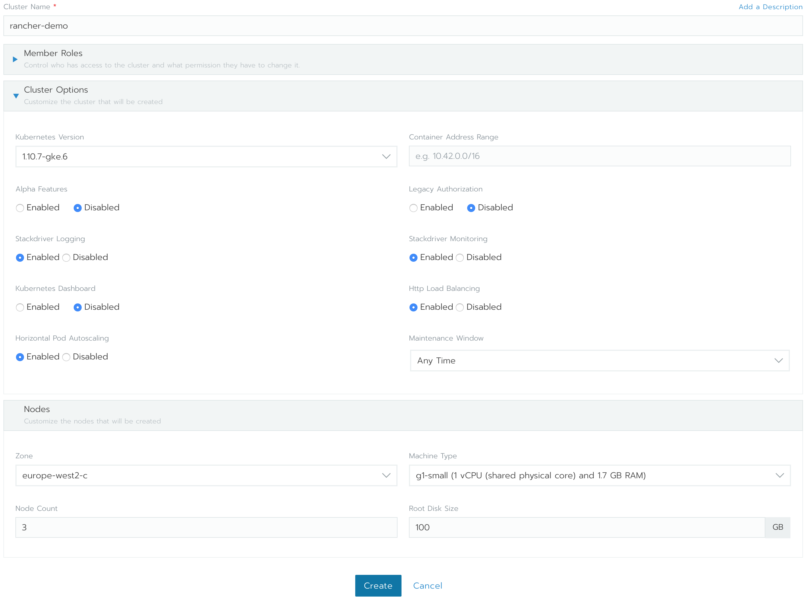
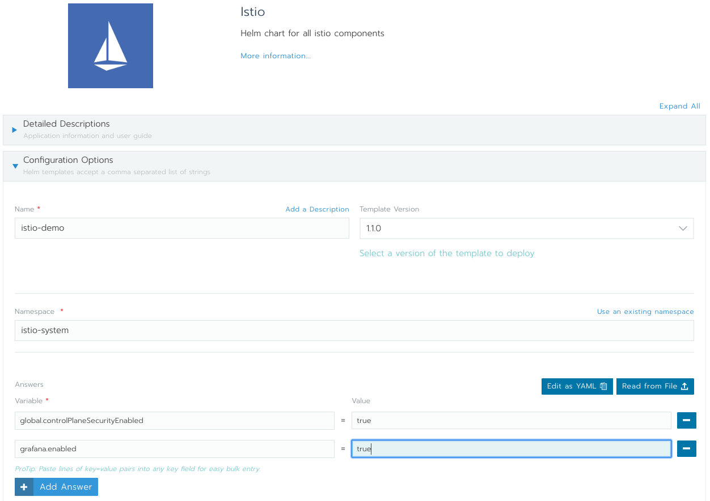

# **Deploying Istio using Rancher 2.0**

Service mesh is a new technology stack aimed at solving the connectivity problem between cloud native applications. If you want to build a cloud native application, you need a service mesh. One of the big players in the service mesh world is Istio. Istio is best described in their own [about page](https://istio.io/about/intro/). It's a very promising service mesh solution, that has multiple tech giants contributing to it.

### Below is an overview of how you can deploy Istio using [Rancher 2.0](https://rancher.com/docs/rancher/v2.x/en/)

Istio, at the moment works best with Kubernetes, but they are working to bring support for other platforms too. So to deploy Istio and demonstrate some of it's capabilities, there's a need of a kubernetes cluster. To do that is pretty easy using Rancher 2.0.

For the beginning, start a Rancher 2.0 instance. There's a very intuitive getting started guide for this purpose [here](https://rancher.com/quick-start/). Just to be sure you'll get the information, the steps will be outlined below too.

This example will use Google Cloud Platform, so let's start and Ubuntu instance there and allow HTTP and HTTPs traffic to it, either via [Console or CLI](https://cloud.google.com/compute/docs/instances/create-start-instance). Here's an example command to achieve the above:
```
gcloud compute --project=rancher-20 instances create rancher-20 \
--zone=europe-west2-a --machine-type=n1-standard-1 \
--tags=http-server,https-server --image=ubuntu-1604-xenial-v20180627 \
--image-project=ubuntu-os-cloud

gcloud compute --project=rancher-20 firewall-rules create default-allow-http \
--direction=INGRESS --priority=1000 --network=default --action=ALLOW \
--rules=tcp:80 --source-ranges=0.0.0.0/0 --target-tags=http-server

gcloud compute --project=rancher-20 firewall-rules create default-allow-https \
--direction=INGRESS --priority=1000 --network=default --action=ALLOW \
--rules=tcp:443 --source-ranges=0.0.0.0/0 --target-tags=https-server
```

Make sure you have at least **1 vCPU** and about **4GB** of RAM available for the rancher instance.
Next step is to ssh into the instance and [install docker](https://docs.docker.com/install/linux/docker-ce/ubuntu/). Once docker is installed, start Rancher and verify it's running:
```
ubuntu@rancher-20:~$ sudo docker run -d --restart=unless-stopped -p 80:80 -p 443:443 rancher/rancher
Unable to find image 'rancher/rancher:latest' locally
latest: Pulling from rancher/rancher
6b98dfc16071: Pull complete
4001a1209541: Pull complete
6319fc68c576: Pull complete
b24603670dc3: Pull complete
97f170c87c6f: Pull complete
c5880aba2145: Pull complete
de3fa5ee4e0d: Pull complete
c973e0300d3b: Pull complete
d0f63a28838b: Pull complete
b5f0c036e778: Pull complete
Digest: sha256:3f042503cda9c9de63f9851748810012de01de380d0eca5f1f296d9b63ba7cd5
Status: Downloaded newer image for rancher/rancher:latest
2f496a88b82abaf28e653567d8754b3b24a2215420967ed9b817333ef6d6c52f
ubuntu@rancher-20:~$ sudo docker ps
CONTAINER ID        IMAGE               COMMAND                  CREATED              STATUS              PORTS                                      NAMES
2f496a88b82a        rancher/rancher     "rancher --http-list…"   About a minute ago   Up 59 seconds       0.0.0.0:80->80/tcp, 0.0.0.0:443->443/tcp   elegant_volhard
```

Get the public IP address of the instance and point your browser to it:
```
$ gcloud compute instances describe rancher-20 --project=rancher-20 --format="value(networkInterfaces[0].accessConfigs[0].natIP)"
35.189.72.39
```
You should be redirected to a HTTPS page of Rancher and you should see a warning from your browser, because Rancher uses a self signed certificate. Ignore the warnings, because this is the instance that you have started (**never do that on untrusted sites!**), and proceed to set up Rancher 2.0 by setting the admin password and server URL. That was it, you have Rancher2.0 running. Now it's time to start your kubernetes cluster.

For that you'll need a Google Cloud Service Account with the following Roles attached to it `Compute Viewer`, `Kubernetes Engine Admin`, `Service Account User`, `Project Viewer`. Afterwards you need to generate service account keys, as described [here](https://cloud.google.com/iam/docs/creating-managing-service-account-keys)
Now get your service account keys (it's safe to use the default Compute Engine service account), you will need them to start a kubernetes cluster using Rancher2.0:
```
gcloud iam service-accounts keys create ./key.json \
    --iam-account <SA-NAME>@developer.gserviceaccount.com
```

Note the `<SA-NAME>@developer.gserviceaccount.com` value, you will need it later.

Now you're ready to start your cluster. Go to rancher dashboard and click on **Add Cluster**. Make sure about the followings:
 * select Google Container Engine for the hosted Kubernetes provider;
 * give your cluster a name, for example `rancher-demo`;
 * import or copy/paste the service key details from above into `Service Account` field;
Proceed with Configure Nodes option and select the followings:
 * for `Kubernetes Version` it should be safe to select the latest available version, this test was done on `1.10.5-gke.2` version;
 * select the zone that is closer to you;
 * for `Machine Type` it needs to be at least n1-standard-1;
 * for Istio Demo, the `Node Count` should be at least 4;
It would look like the image below:



Click with confidence on ***Create***

After several minutes you should see your cluster as active in Rancher dashboard. Remember that `<SA-NAME>@developer.gserviceaccount.com` value? You need it now to grant cluster admin permissions to the current user (admin permissions are required to create the necessary RBAC rules for Istio). To do that, click on the `rancher-demo` Cluster Name in Rancher Dashboard, that will take you to rancher-demo Cluster dashboard, that should look similar to the image below:


Now `Launch kubectl`, this will open a kubectl command line for this particular cluster. You can also export the `Kubeconfig File` to use with your locally installed kubectl. For this purpose it should be enough to use the command line provided by Rancher. Once you have the command line opened, run the following command there:
```
> kubectl create clusterrolebinding cluster-admin-binding \
    --clusterrole=cluster-admin \
    --user=<SA-NAME>@developer.gserviceaccount.com

clusterrolebinding "cluster-admin-binding" created
>
```

Istio has a helm package and Rancher can consume that helm package and install Istio. To get the official istio helm package, it's best to add istio's repository to Rancher Apps Catalog. To do that, go to Rancher **Global** View, then to **Catalogs** option and select `Add Catalog`. Fill in there as follows:
* for name, let's put there `istio-github`;
* in Catalog URL, paste the following URL: https://github.com/istio/istio.git (Rancher works with anything git clone can handle)
* the Branch part should allow you now to write the branch name, set it to `master`
It should look as in the screenshot below:


Hit **Create**

At this stage, you should be able to deploy Istio using Rancher's Catalog. To do that, go to the Default Project of `rancher-demo`'s project and select `Catalog Apps` there. Once you clikc on **Launch**, you will be presented with a number of default available applications. As this demo is about Istio, select from All Catalogs, the `istio-github` catalog. This will present you with 2 options `istio` and `istio-remote`. Select `View Details` for **istio** one. You'll be presented with the options to deploy Istio. Select the followings:
* let's set the name to `istio-demo`;
* leave the template version to *0.8.0*;
* the default namespace used for istio is `istio-system`, thus set the namespace to `istio-system`;
* by default, Istio doesn't encrypt traffic between it's components. That's a very nice feature to have, let's add it. This is done by setting to true the `global.controlPlaneSecurityEnabled` variable. To do this:
  - click **Add Answer**;
  - put the variable name `global.controlPlaneSecurityEnabled`;
  - set it's Value to `true`;

All of the above should look like in the screenshot below:



Everything looks good, click on **Launch**

Now if you look at the workloads tab, you should see there all the components of Istio spinning up in your Cluster. Make sure all of the workloads are green. Also, check the Load Balancing tab, you should have `istio-ingress` and `istio-ingressgateway` there, both in `Active` state.

In case you have `istio-ingressgateway` in `Pending` state, you need to apply `istio-ingressgateway` service once again. To do that:
* click on **Import Yaml**;
* for Import Mode, select `Cluster: Direct import of any resources into this cluster`;
* copy/paste the below Service into the Import Yaml editor and hit **Import**:
```
apiVersion: v1
kind: Service
metadata:
  name: istio-ingressgateway
  namespace: istio-system
  labels:
    chart: ingressgateway-0.8.0
    release: RELEASE-NAME
    heritage: Tiller
    istio: ingressgateway
spec:
  type: LoadBalancer
  selector:
    istio: ingressgateway
  ports:
    -
      name: http
      nodePort: 31380
      port: 80
    -
      name: https
      nodePort: 31390
      port: 443
    -
      name: tcp
      nodePort: 31400
      port: 31400
```  
This step should solve the `Pending` problem with `istio-ingressgateway`.

You should now check that all Istio's `Workloads`, `Load Balancing` and `Service Discovery` parts are green in Rancher Dashboard.

Only now, you can deploy a test application and test the power of Istio.
